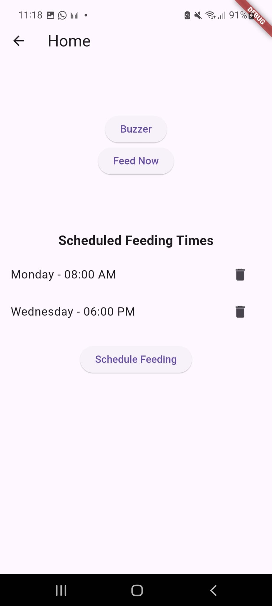
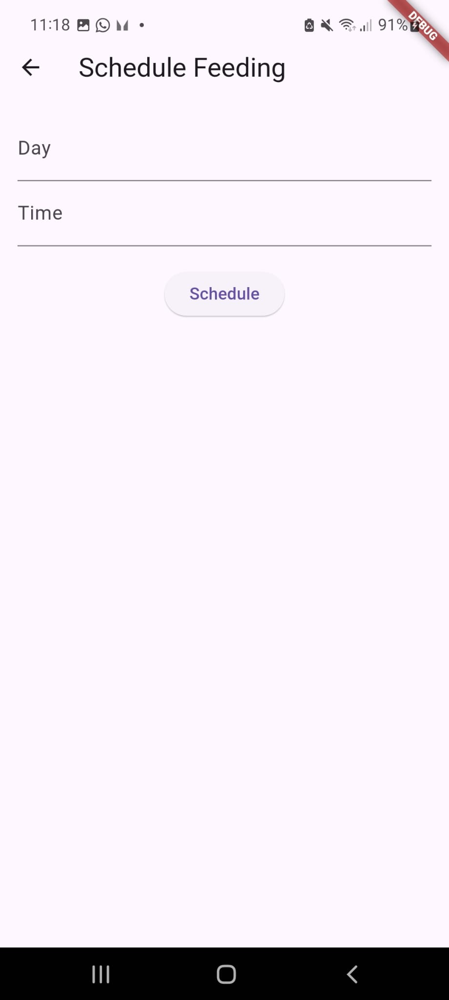
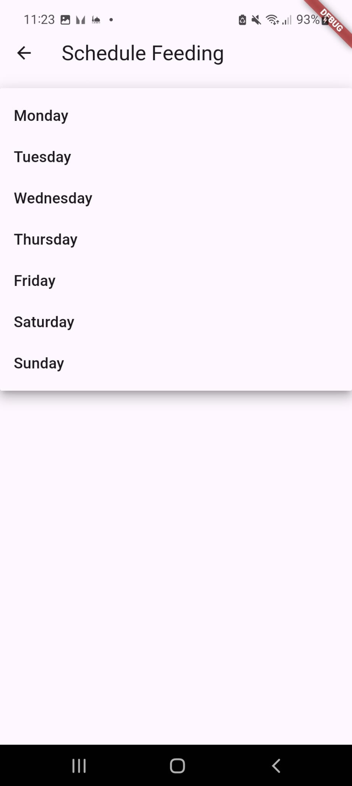
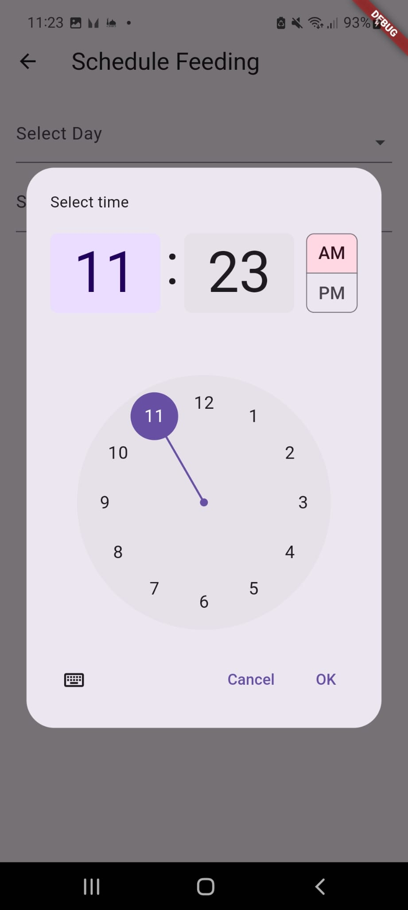

# IoT Smart Pet Feeder

Pet Feeder is a simple smart pet feeding system built on the ESP8266 platform. It allows pet owners to schedule and automate feeding times for their pets, ensuring they are fed even when the owner is away.

## Features

- **Scheduled Feedings**: Set specific times for your pet to be fed automatically.
- **Manual Override**: Feed your pet manually through the app at any time.
- **Wi-Fi Connectivity**: Control the feeder remotely via a web interface.
- **Real-Time Monitoring**: Monitor the status of the feeder and feeding times.

## 📸 Screenshots

<div style="display: flex; gap: 10px; flex-wrap: wrap;">

  
  
  
  
  

</div>

## Hardware Components

- **ESP8266**: The microcontroller that connects to Wi-Fi and controls the feeding mechanism.
- **Servo Motor**: Dispenses food by rotating a container lid.
- **Real-Time Clock (RTC) Module**: Keeps track of time for scheduled feedings.
- **Push Buttons**: Used for manual feeding and setting configurations.
- **LCD Display**: Displays current time, feeding schedule, and status.

## Software Components

- **Arduino IDE**: Used for programming the ESP8266.
- **ESP8266 Board Support**: Install the ESP8266 board package in the Arduino IDE.
- **Libraries**:
  - `Wire.h`: For I2C communication.
  - `LiquidCrystal_I2C.h`: For controlling the LCD display.
  - `RTClib.h`: For interfacing with the RTC module.
  - `Servo.h`: For controlling the servo motor.

## Installation

1. **Clone the Repository**:

   ```bash
   git clone https://github.com/seifddin02/pet-feeder.git
   cd pet-feeder
   ```

2. **Install Required Libraries**:

   In the Arduino IDE, go to **Sketch > Include Library > Manage Libraries** and install the following libraries:
   - `Wire`
   - `LiquidCrystal_I2C`
   - `RTClib`
   - `Servo`

3. **Configure the Code**:

   - Set your Wi-Fi credentials in the code.
   - Adjust the feeding schedule and other parameters as needed.

4. **Upload to ESP8266**:

   Connect your ESP8266 to your computer and upload the code using the Arduino IDE.

## Usage

- **Automatic Feeding**: The feeder will dispense food at the scheduled times.
- **Manual Feeding**: Press the manual feed button to dispense food immediately.
- **Status Monitoring**: The LCD will display the current time and next feeding time.

## License

This project is licensed under the MIT License - see the [LICENSE](LICENSE) file for details.

## Acknowledgements

- [ESP8266 Community](https://github.com/esp8266) for the ESP8266 platform.
- [Arduino](https://www.arduino.cc/) for the development environment.
- [Adafruit](https://www.adafruit.com/) for the RTC and LCD libraries.

